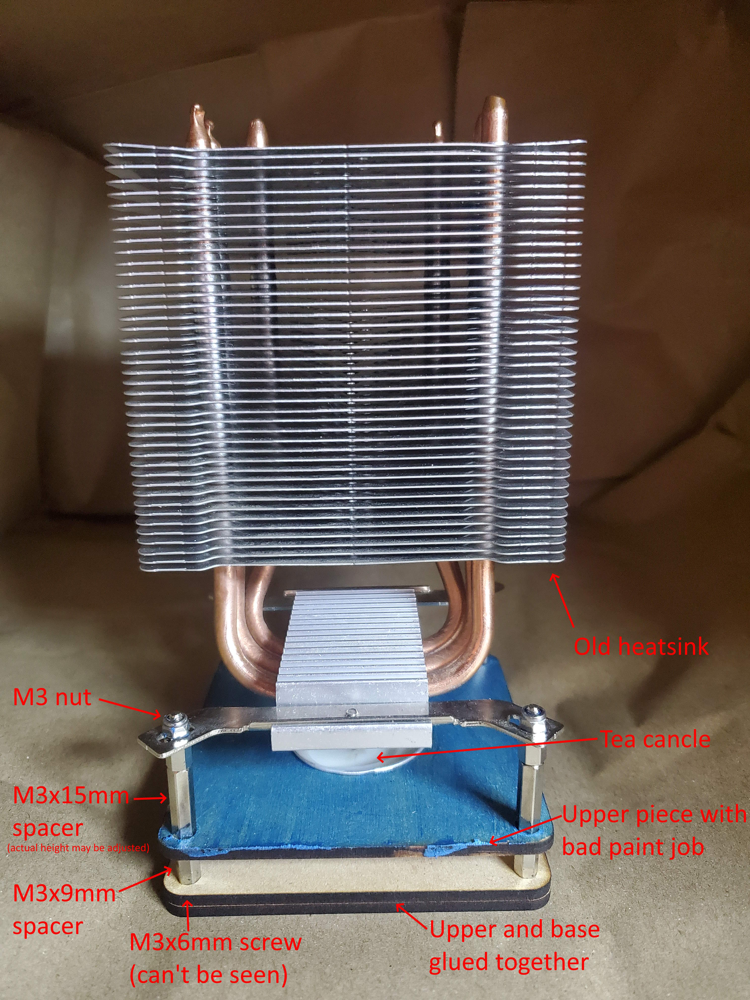

# Candle heatsink

Some weird contraption I made with a tea candle and an old heatsink.

## Bill of materials

* 2 x "upper" parts of design
* 1 x "base" part of design
* 4 x M3 nuts
* 4 x M3x9mm standoffs
* 4 x M3x15mm (approximate height) standoffs
* 4 x M3x6mm pan head screws
* An old heat sink from a computer
* Glue

